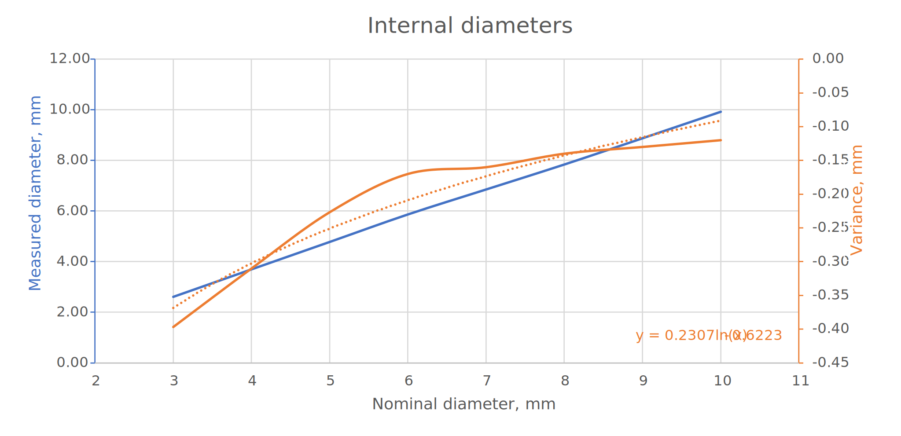

# metrology
I love fasteners, and threaded inserts for 3D printing are great. You can get *a lot* of clamping power from a relatively small fastener. Let's consider the humble RawlPlug for comparison:

According to Rawlplug, the ubiquitous red #6 has a characteristic force (a metric which is slightly lower than force required to pull the plug out axially) of 1200 N [[1]] in concrete, and 200 N in plasterboard. A heat staked M3 threaded insert has a pullout force of 1000 N [[2]] in ABS plastic. And you can screw into and out of it repeatedly without wrecking it. Thats a lot of force. You could hang a newborn elephant calf from one single M3 insert1.

And that's why it drives me mad when I'm on a 3D printing forum or social media group and everyone loses their collective minds when they see someone screwing directly into 3D printed components. It's *fine*, seriously. If you don't need to regularly remove the fastener, and you're not in the business of suspending elephants then just go for it, it'll probably be good enough for the home tinkerer.

In order to get a good fit between the bolt and the hole in your 3D printed part you need to get the diameter of the hole *just right*. This depends on a lot of different cariables, to name a few:
- Type of printer
- Printing material
- Layer height / wall thickness
- Temperature
- Humidity 
- Printing speed

The list just goes on and on frankly, and some of these variable are difficult or impossible to control, so the easiest way to decide this is by trial and error. I printed a sample of holes with nominal diameters from 3 to 10 mm, here's an example of one of the test pieces:

This took 1 minute (after pre warming) to print on my Ender 3 V2, so it's really quick to iterate and I can bang out sample pieces really quickly. The layers of plastic laid down by my printer (layer height) is 0.2 mm and the lines of plastic it lays down to build up material are 0.4 mm thick, my dimensions reflet this, in theat the wall of the test holes are 1.2 mm thick meaning the software will put down exactly 3 lines around each hole, and it won't get confused. Once printed I took a pair of cheap calipers and measure the internal diameters of the holes, and compared the measured size after printing to the nominal size in the CAD software:

The blue line appears to show a linear relationship between nominal and measured size, but this isn't the whole story. Subtracting the nominal size from the measured size gives us the variance, the "overspill" of the printer if you like. This shows a logarithmic relationship. And this gets to the whole point of the issue. FDM printers suck at small details2, especially circles, like 3mm bolt holes. I'm sure this is something to do with the squeezing of the heated thermoplastic out of the extruder and the geometric properties of circles, but I'm not going to get into it. Suffice to say that the smaller the hole you tell the printer to print, the more *out of whack* it is.

The dotted line orange line shows a logarithmic trendline, and the equation for this (handily provided by Excel) is:
`y = 0.2307ln(x) - 0.6223`

[1]: https://www.rawlplug.co.uk/wp-content/uploads/2020/03/Rawlplug_catalogue_Specification_Design_Guide_2020_compressed.pdf#page135 "Specification & Design Guide, Rawlplug"

[2]: https://www.pemnet.com/fastening_products/pdf/sidata.pdf#page=16 "SI Threaded inserts for plastics"

1 Don't do this. There are multiple other points of failure, including the bulk material around the insert and your puny M3 bolt.
2 Above 10mm nominal radius holes the variance was always 0.1 mm. You often see the figure 0.1 mm in 3D printing guides when talking about tolerance and clearance, and this is why.
