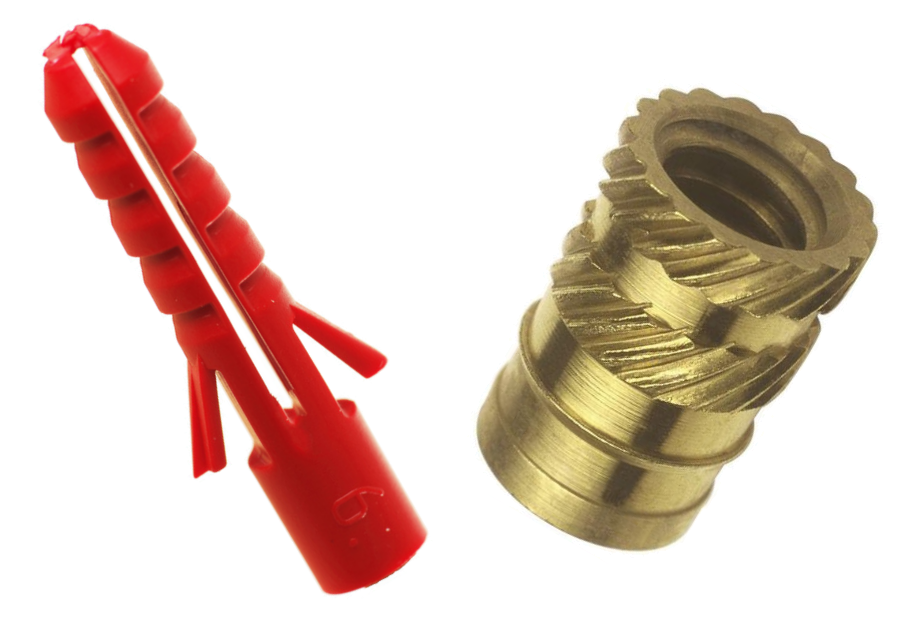
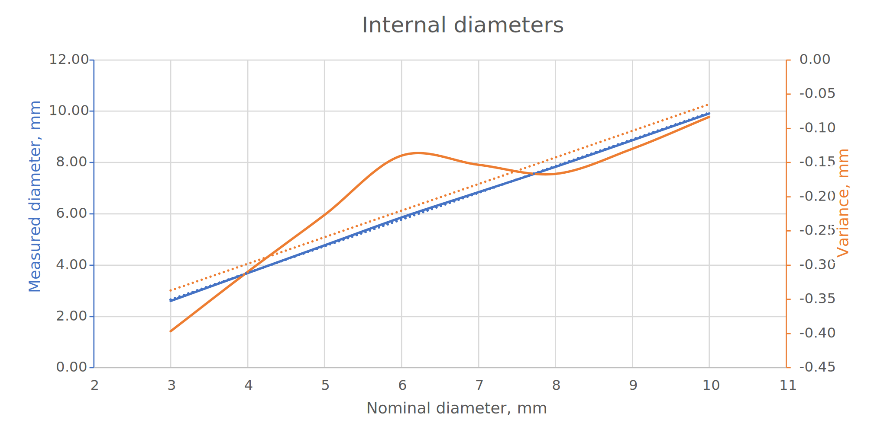

# metrology
I love fasteners, and threaded inserts for 3D printing are great. You can get *a lot* of clamping power from a relatively small fastener. Let's consider the humble RawlPlug for comparison:

According to Rawlplug, the ubiquitous red #6 has a characteristic force (a metric which is slightly lower than force required to pull the plug out perpendicular to the surface) of 1200 N [[1]] in concrete, and 200 N in plasterboard. A heat staked M3 threaded insert has a pullout force of 1000 N [[2]] in ABS plastic. And you can screw it in and out without wrecking it. Thats a lot of force. You could hang a newborn elephant calf from one single M3 insert1.

And that's why it drives me mad when I'm on a 3D printing forum or social media group and everyone loses their collective minds when they see someone screwing directly into 3D printed components. It's *fine*, seriously. If you don't need to regularly remove the fastener, and you're not in the business of suspending elephants then just go for it, it'll probably be good enough for the home tinkerer.

[1]: https://www.rawlplug.co.uk/wp-content/uploads/2020/03/Rawlplug_catalogue_Specification_Design_Guide_2020_compressed.pdf#page135 "Specification & Design Guide, Rawlplug"

[2]: https://www.pemnet.com/fastening_products/pdf/sidata.pdf#page=16 "SI Threaded inserts for plastics"

1 Don't do this. There are multiple other points of failure, including the bulk material around the insert and your puny M3 bolt.
